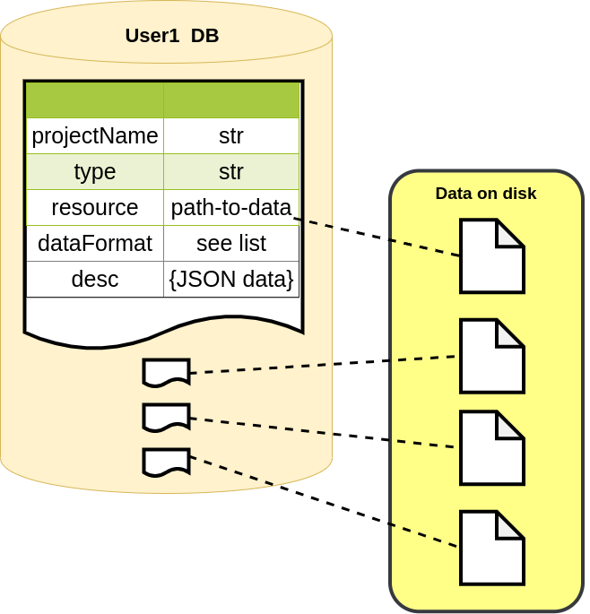

datalayer
*********

The data the that is produced in by the measurements or the simulation might be large
and therefore we usually store the data on the disk
and keep only the metadata in the database. Each record in the database (called a 'document') represents
a single piece of data (pandas, dask, xarray or any other data) associated with a project.

The meta data includes the fields:

 - The project name that contains the data.
 - The data (or a reference to it).
 - The format of the data on the disk.
 - fields that describe the data.

Each user has its own database that stores documents, but it is also possible to access
a different databases.

The datalayer also includes a command line interface to load, remove and move data around.

Setup
=====

The library uses a connection to the databse that is defined in the path
~/.pyhera/config.json. The structure of the config.json is

..  code-block:: javascript

    {
    <connection name 1> : {
        "dbIP": "DB IP",
        "dbName": "...",
        "password": "..." ,
        "username": "..."
    },
    <connection name 1> : {
        "dbIP": "DB IP",
        "dbName": "...",
        "password": "..." ,
        "username": "..."
    }
}

The default connection is the default with the linux user name.
It is possible to add other database connections. See below on how
to access other databases.

10-minute tutorial
===================

This tutorial demonstrate how to store and retrieve data from the database
with the default connection (the username of the linux system).

Adding Data
-----------

first, import the requested module:

.. code-block:: python

    from hera import datalayer

Each data is classified into one of the following categories.

- Measurements - Any acquisition of data from the 'real world'. Satellites, meteorological measurments and dispersion measurements and etc.
- Simulations  - Any output of a model. (OpenFOAM, WRF, LSM and etc).
- Analysis     - Any data that is created during work and analyis and needed to be cached to accelerate the computations.

Since each category can hold different types of data, each data document
holds its type in  a 'type' property
when saving a new document in the database, you must provide 'projectName', 'desc', 'dataFormat' and 'resource'

for example, a Measurements data from type Meteorology and parquet data files format should be added to database like this:

.. code-block:: python

    datalayer.Measurements.addDocument(projectName='myProjectName',
                                       resource='path-to-parquet-files-on-disk',
                                       dataFormat=datalayer.datatypes.PARQUET,
                                       type='Meteorology'
                                       desc={'property1': 'value1',
                                             'property2': 'value2'
                                             }
                                       )

Querying data
---------------

When querying the database, you have to provide the 'projectName'
and conditions that will be used as filters.

If the filter field is not type, resource or dataFormat, the query
will be performed on the desc field.

For example, for the following query you will get all of the documents
in the project 'projectName' that 'property1' in the desc property equals 'value1'

.. code-block:: python

    docList = datalayer.Measurements.getDocuments(projectName='projectName',property1='value1')

Now, you can use the function getData() to retrieve data presented by the document.
For example, we will read the first document from the docList and get its data.

.. code-block:: python

    doc = docList[0]
    data = doc.getData()

The getData method loads the data from the database according to the 'dataFormat'.

Updating data
------------

It is possible to update the data of the record.
to do so, just add the new properties to the record and save it.

.. code-block:: python

    doc = docList[0]
    doc.desc['newproperty'] = 'newValue'
    doc.save()

Similalry, it is possible to remove a property from the record

.. code-block:: python

    doc = docList[0]
    del doc.desc['newproperty']
    doc.save()

Delete data
------------
.. code-block:: python

    doc = docList[0]
    doc.delete()

Advanced Querying data
----------------------

Querying data relies on the mongoDB query language to
query the desc. Briefly, in the mongoDB language translates the JSON path to a
the list of keys seperated by '__'.

for example if the desc field of the document is

.. code-block:: javascript

    "a" : {
        "b" : {
            "c" : 1,
            "d" : [1,2,3],
            "e" : "A"
        },
        "b1" : 4
    }

The the path of the "c" key-path is 'a__b__c'.
So querying the documents where 'c' field is 1 is done as follows:

.. code-block:: python

    docList = datalayer.Measurements.getDocuments(projectName='projectName',a__b__c=1)

It is possible to add operators to query all the documents that fulfil a certain criteria.
For example add '__lt' to find all the documents that are less than a value.

.. code-block:: python

    docList = datalayer.Measurements.getDocuments(projectName='projectName',a__b__c__lt=1)
    docList = datalayer.Measurements.getDocuments(projectName='projectName',a__b__d__in=1)

The last line retrieves all the documents that the field 'd' includes the item 1 in it.

Usage
=====

.. toctree::
    :maxdepth: 2

    datalayer/cli
    datalayer/usage
    datalayer/datahandlers
    datalayer/api
