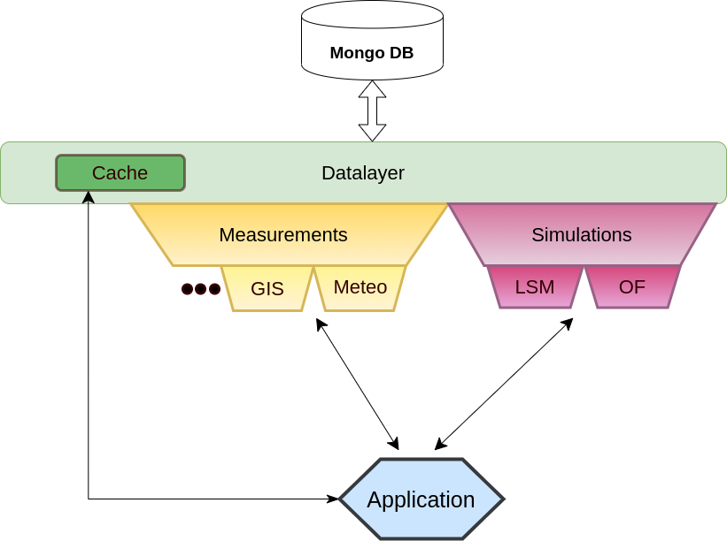

.. pyhera documentation master file, created by
   sphinx-quickstart on Tue Nov 26 15:51:03 2019.
   You can adapt this file completely to your liking, but it should at least
   contain the root `toctree` directive.

Welcome to pyhera's documentation!
##################################

The 'Hera' project aims to make the departmental data more accessible and to standardize its storage,
and provide tools for analysis and presentation.

The library manages data by providing interface to store pieces of data
and their metadata (i.e description of the data). Then, the library
provides analysis and presentation tool that are specialized for different tasks.

Datalayer
^^^^^^^^^

Tools to stome the metadata (data that describes the data itself) of
each piece of data as a document in the database.

A general layer that helps to manage the metadata records.
               It can be used directly through other layers.

Cache
^^^^^
Caching data after long computation.

Measurements
^^^^^^^^^^^^

Provide tools to manage data that originates from measurements.
Contains several specializations:

   - GIS: Manages GIS data. Allows to slice and store regions
         as well as raster data.

   - Meteorological: Manages meteorological data, provide tools to analyze:
      - Raw sonic data
      - Data or mean data from IMS.

Simulations
^^^^^^^^^^^

Data that originates from simulations.

Contains several specializations:

    - OpenFOAM: manage openFOAM simulations.
    - LSM: Manage Lagrangian stochastic models.

.. toctree::
   :maxdepth: 3
   :caption: Contents:

   datalayer
   measurements
   simulations
   riskassessment
   instructions_for_dev
   how_to
   auto_examples/index

Indices and tables
==================

* :ref:`genindex`
* :ref:`modindex`
* :ref:`search`
